# /co-founder

A co-founder, not a yes-man.

Most AI tools do whatever you ask. That is the problem. /co-founder is a collection of 12 skills
for Claude Code that runs your business with you, and pushes back like a real co-founder would:

- It refuses to build on half-baked ideas. Vision first, then the gauntlet, then the plan, then
  the work. Skip a stage and it asks you the missing questions instead of producing junk.
- It never ships consequential advice on vibes. Go/no-go, strategy, pricing, customer-facing,
  money, and hard-to-reverse recommendations need a fact about YOUR business plus a checked
  outside source. If either leg is missing, the recommendation parks and names the next check.
- It banks every lesson. Every lesson, decision, and research run lands in your own vault as plain markdown
  files you own. Week 20 is dramatically smarter than week 1.

## Install

You need a paid Claude plan, Claude Code 2.1.206 or newer, and Git. Paste this line into a system
terminal (not into a running Claude session):

```sh
claude plugin marketplace add machina-exm/co-founder
```

That adds the marketplace this plugin ships from. It installs nothing yet.

### After adding the marketplace

Create your business folder, install the plugin, and open a fresh session:

```sh
mkdir -p my-business && cd my-business
claude plugin install co-founder@co-founder --scope user
claude
```

The fresh session matters: newly installed skill triggers register the moment it starts. In that
session, run `/co-founder:co-founder-setup`. Setup interviews you, writes your personalized business
charter, and scaffolds your vault in the current folder. Most founders spend 15-20 minutes on its
eight one-at-a-time questions and final confirmation.

Claude Desktop is optional. To use it after the CLI install, open **Code → Local**, select the same
business folder, and start a fresh session there. Review the repository before granting folder and
plugin trust.

### Verify a local checkout

From the `co-founder` repository root, these exact commands prove the local marketplace and installed
cache in an isolated home. Marketplace add intentionally has no `--scope` flag; local sources are
not registered reliably with that flag in supported CLI builds.

```sh
scratch=$(mktemp -d)
HOME="$scratch/home" claude plugin marketplace add "$PWD"
HOME="$scratch/home" claude plugin install co-founder@co-founder --scope user
HOME="$scratch/home" claude plugin list --json | ruby -rjson -e '
  plugin = JSON.parse($stdin.read).find { |entry| entry["id"] == "co-founder@co-founder" }
  puts "installed: #{plugin["id"]} #{plugin["version"]} enabled=#{plugin["enabled"]}"
'
HOME="$scratch/home" claude plugin details co-founder@co-founder | sed -n '1,/  Agents/p'
rm -rf "$scratch"
```

## Update

Marketplace plugins do not automatically update by default. Exit any running Claude session, then
paste this one line in the business folder:

```sh
claude plugin marketplace update co-founder && claude plugin update co-founder@co-founder --scope user && claude
```

Confirm the listed version, start the fresh session, then run `/co-founder:co-founder-setup`. Setup enters
re-sync mode: it updates the charter and scaffold contracts while preserving founder-written
content.

Release history, compatibility, and migration notes live in [CHANGELOG.md](CHANGELOG.md).

## Troubleshooting

- **`co-founder@co-founder` is not found:** run `claude plugin marketplace update co-founder`, retry
  the install command, then inspect `claude plugin details co-founder@co-founder`.
- **The skills do not appear after install or update:** `claude plugin list --json` must show the
  plugin enabled and `claude plugin details co-founder@co-founder` must show 13 skills. Exit the
  running session and start a new `claude` process after that check.
- **Setup opened in the wrong place:** stop before accepting file changes. Create an empty
  business folder, start a new **Code → Local** session in it, and run setup there.
- **A Windows Local session will not start:** install Git, restart Claude Desktop, and select the
  folder again.
- **The update still looks old:** confirm the expected version in `claude plugin list --json`. If
  it did not change, update the marketplace and plugin again, then start a fresh session.

## The skills

| Skill | What it does |
|-------|--------------|
| `co-founder-setup` | One-time interview → your charter, your vault, your voice file |
| `vision` | Interrogates the fuzzy picture in your head into a durable strategy file |
| `plan` | Scopes any initiative through the readiness gates |
| `gauntlet` | The anti-yes-man: investor-grade interrogation until your idea survives or dies |
| `research` | Live, verified, cited answers, the no-slop engine |
| `sprint` | Daily driver: where you are, the one next move, honest roadmaps |
| `review` | Weekly scorecard + max ONE system change per week |
| `bank` | Banks every lesson with what it cost and returned; debrief mode for calls |
| `steward` | Keeps your vault true: files new knowledge, prunes stale notes |
| `recall` | Checks what your business already knows before any big call |
| `offer` | Design, price, and close your offer, with operator-grade heuristics |
| `content-engine` | Writing/X/newsletter content, in your voice, from your facts |

### The boards

One board per skill — how each one actually works. Also in `assets/visuals/`, with the editable
HTML original beside every image.

#### co-founder-setup
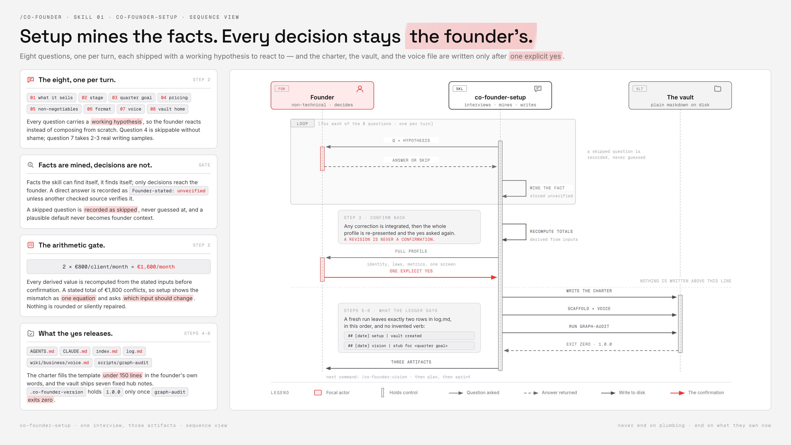

#### vision
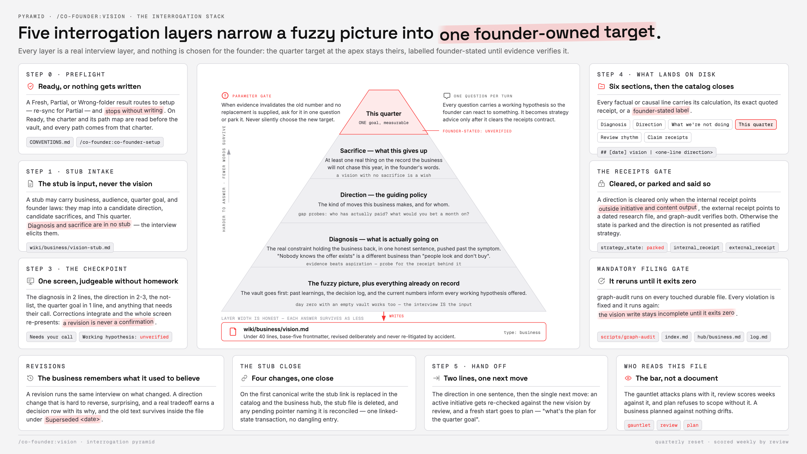

#### plan
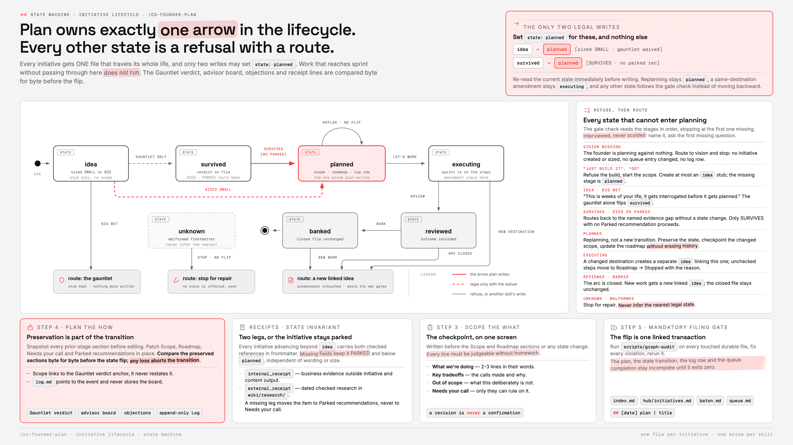

#### gauntlet
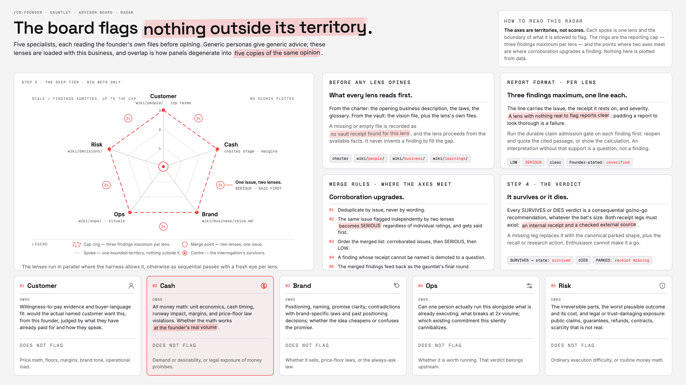

#### research
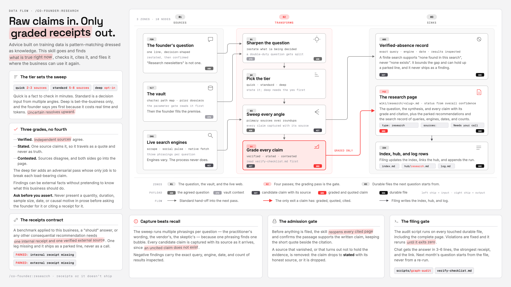

#### sprint
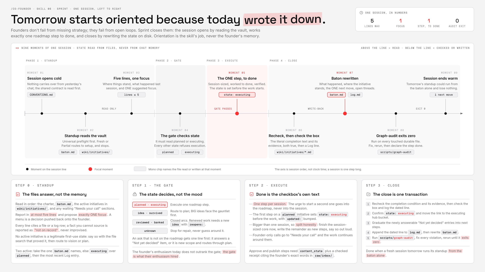

#### review
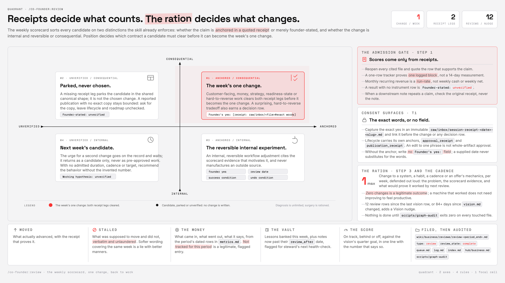

#### bank
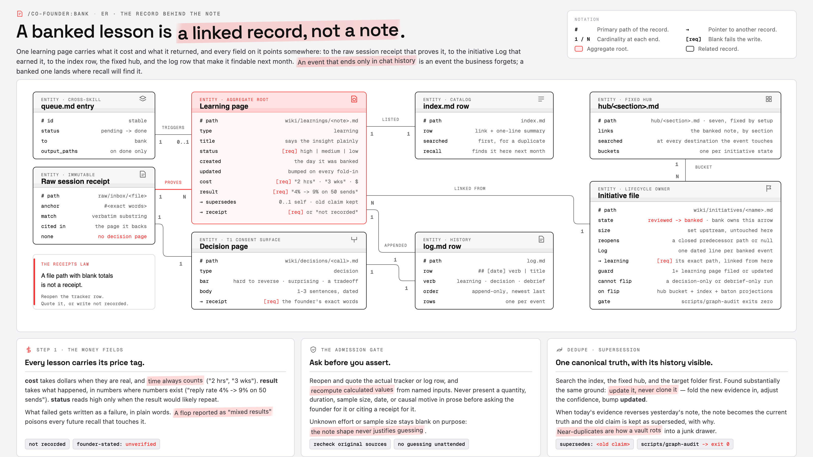

#### steward
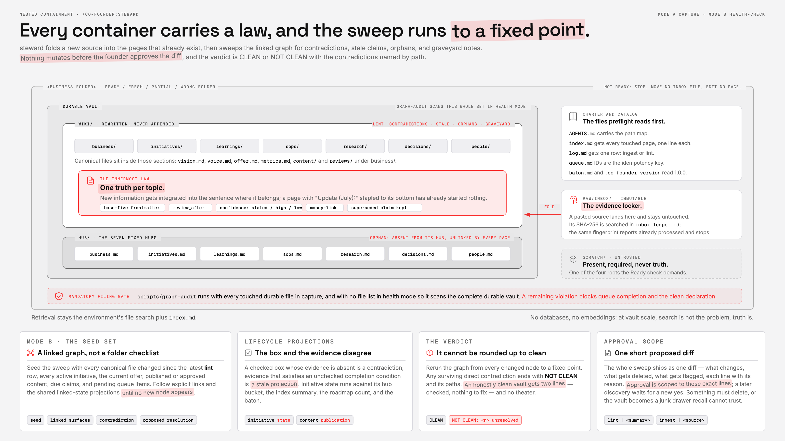

#### recall
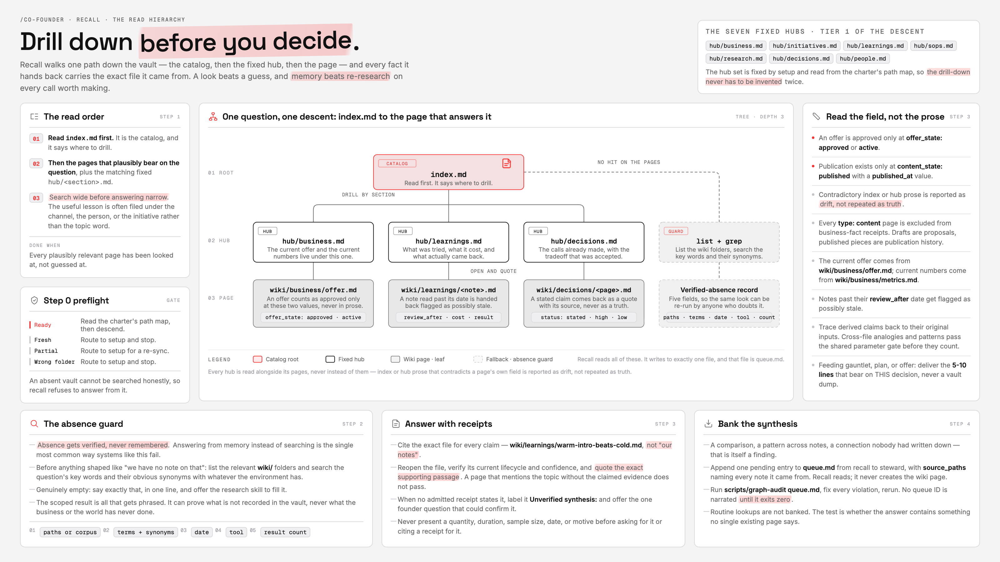

#### offer
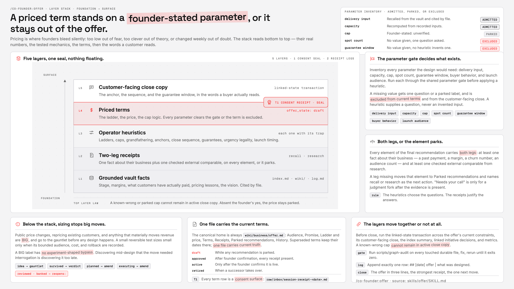

#### content-engine
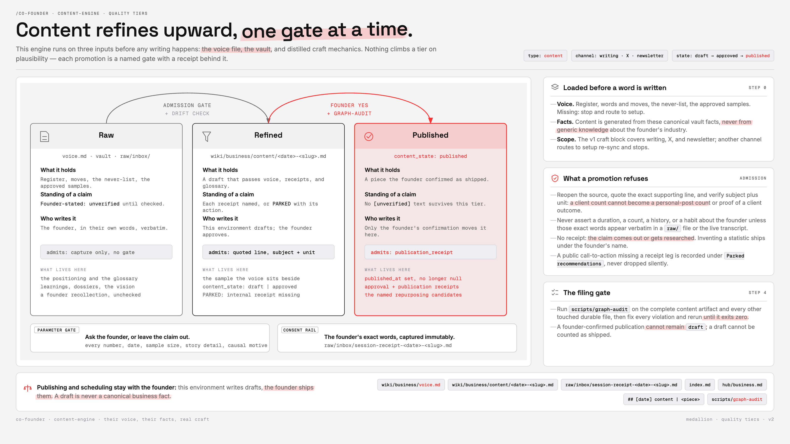

#### help
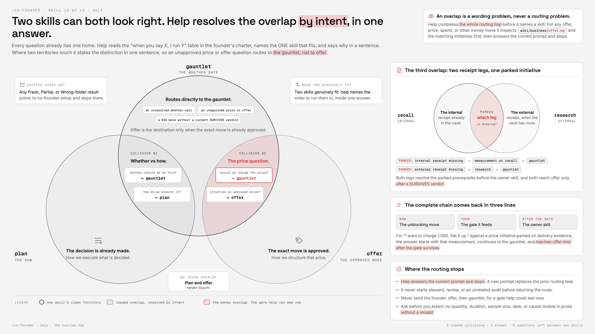

Installed and namespaced as a Claude Code plugin. The charter, vault, and business artifacts it
creates are plain markdown files that remain readable and portable outside Claude Code.

## Other coding agents

Claude Code is the recommended way to run /co-founder: it is the only surface with the full plugin
experience (marketplace installs, updates, the exact flows above). If you already live in another
agent, the collection also runs there. Same skills, same gates, same vault.

| Agent | Install | Note |
|---|---|---|
| Codex CLI | `codex plugin marketplace add machina-exm/co-founder`, then open `/plugins` and install co-founder. New session after install. | Works on free ChatGPT plans. Skills invoke as `$skill-name`. |
| Grok Build | Nothing extra. If the Claude Code plugin is installed on your machine, Grok finds it automatically. | Verify with `grok inspect` — it should list the 13 skills under `plugin: co-founder`. |
| Kimi Code CLI | In the Kimi TUI: `/plugins install https://github.com/machina-exm/co-founder`, confirm trust, then `/reload`. | Requires a paid Kimi membership. Commands appear as `/co-founder:<skill>`. |
| OpenCode and 70+ others | `npx skills add machina-exm/co-founder/.agents/skills` inside your business folder. | Use exactly this path form. Then ask the agent "what skills do you have?" to confirm all 13 loaded. |
| Hermes Agent | One-paste local install — see [the Hermes repo](https://github.com/machina-exm/co-founder-hermes). | Power-user runtime: you bring your own model keys. |

After any install, the first move is the same everywhere: open your business folder and say
"set up co-founder". If a skill does not appear, the most common cause is a name clash with a
skill you already have installed globally.

Maintainer porting notes and per-agent smoke checklists live in `docs/porting/`.
